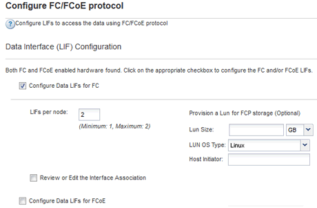

= Configurare FC su una SVM esistente
:allow-uri-read: 
:icons: font
:imagesdir: ../media/

[role="lead"]
È possibile configurare FC su una macchina virtuale di storage (SVM) esistente e creare un LUN e il relativo volume con una singola procedura guidata. Il protocollo FC deve essere già abilitato ma non configurato su SVM. Queste informazioni sono destinate alle SVM per le quali si stanno configurando più protocolli, ma non sono ancora stati configurati FC.

.Prima di iniziare
Il fabric FC deve essere configurato e le porte fisiche desiderate devono essere collegate al fabric.

.Fasi
. Accedere alla finestra *SVM*.
. Selezionare la SVM che si desidera configurare.
. Nel riquadro SVM**Details** (Dettagli SVM), verificare che *FC/FCoE* sia visualizzato con uno sfondo grigio, che indica che il protocollo è abilitato ma non completamente configurato.
+
Se viene visualizzato *FC/FCoE* con uno sfondo verde, la SVM è già configurata.

+
image::../media/existing_svm_protocols_fc_rhel.gif[L'immagine mostra la pagina dei dettagli con tutti e quattro i protocolli con sfondo grigio.]

. Selezionare il collegamento del protocollo *FC/FCoE* con lo sfondo grigio.
+
Viene visualizzata la finestra Configure FC/FCoE Protocol (Configura protocollo FC/FCoE).

. Configurare il servizio FC e i LIF dalla pagina *Configure FC/FCoE Protocol* (Configura protocollo FC/FCoE):
+
.. Selezionare la casella di controllo *Configura LIF dati per FC*.
.. Invio `2` Nel campo *LIF per nodo*.
+
Per ciascun nodo sono necessarie due LIF, per garantire disponibilità e mobilità dei dati.

.. Selezionare *Submit & Close* (Invia e chiudi).

+

. Esaminare la pagina *Riepilogo*, registrare le informazioni LIF, quindi selezionare *OK*.

