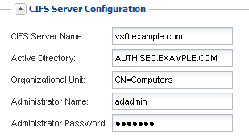

= Aggiungere l'accesso CIFS e NFS a una SVM esistente
:allow-uri-read: 
:icons: font
:imagesdir: ../media/

[role="lead"]
L'aggiunta dell'accesso CIFS/SMB e NFS a una SVM esistente implica la creazione di una LIF dati, la configurazione di un server CIFS, l'abilitazione di NFS e, facoltativamente, la configurazione di NIS.

.Prima di iniziare
* È necessario sapere quali dei seguenti componenti di rete verranno utilizzati da SVM:
+
** Il nodo e la porta specifica su quel nodo in cui verrà creata l'interfaccia logica dati (LIF)
** La subnet da cui verrà fornito l'indirizzo IP del LIF dei dati o, facoltativamente, l'indirizzo IP specifico che si desidera assegnare al LIF dei dati
** Il dominio Active Directory (ad) a cui si unisce questa SVM, insieme alle credenziali richieste per aggiungervi la SVM
** Informazioni NIS se il sito utilizza NIS per i servizi di nome o la mappatura dei nomi

* Tutti i firewall esterni devono essere configurati in modo appropriato per consentire l'accesso ai servizi di rete.
* L'ora dei domain controller, dei client e della SVM di ad deve essere sincronizzata entro cinque minuti l'uno dall'altro.
* I protocolli CIFS e NFS devono essere consentiti su SVM.
+
Questo è il caso se non si è seguita questa procedura per creare SVM durante la configurazione di un protocollo diverso.

.A proposito di questa attività
L'ordine di configurazione di CIFS e NFS influisce sulle finestre di dialogo visualizzate. In questa procedura, è necessario configurare prima CIFS e poi NFS.

.Fasi
. Accedere all'area in cui è possibile configurare i protocolli di SVM:
+
.. Selezionare la SVM che si desidera configurare.
.. Nel riquadro *Dettagli*, accanto a *protocolli*, fare clic su *CIFS*.
+
image::../media/svm_add_protocol_multi_1st_cifs.gif[Questa immagine viene spiegata dal testo circostante.]

. Nella sezione *Data LIF Configuration* della finestra di dialogo *Configure CIFS Protocol* (Configura protocollo CIFS), creare una LIF dati per SVM:
+
.. Assegnare automaticamente un indirizzo IP alla LIF da una subnet specificata o immetterlo manualmente.
.. Fare clic su *Browse* (Sfoglia) e selezionare un nodo e una porta da associare alla LIF.
+
image::../media/svm_setup_cifs_nfs_page_lif_multi_nas_nas_mp.gif[Questo grafico è descritto dal testo circostante.]

. Nella sezione *CIFS Server Configuration*, definire il server CIFS e configurarlo per accedere al dominio ad:
+
.. Specificare un nome per il server CIFS univoco nel dominio ad.
.. Specificare l'FQDN del dominio ad a cui il server CIFS può accedere.
.. Se si desidera associare un'unità organizzativa (OU) all'interno del dominio ad diversa da CN=Computers, immettere l'unità organizzativa.
.. Specificare il nome e la password di un account amministrativo con privilegi sufficienti per aggiungere il server CIFS all'unità organizzativa.
.. Se si desidera evitare l'accesso non autorizzato a tutte le condivisioni su questa SVM, selezionare l'opzione per crittografare i dati utilizzando SMB 3.0.

+

. Creare un volume per l'accesso CIFS/SMB ed eseguire il provisioning di una condivisione:
+
.. Assegnare un nome alla condivisione utilizzata dai client CIFS/SMB per accedere al volume.
+
Il nome immesso per la condivisione verrà utilizzato anche come nome del volume.

.. Specificare una dimensione per il volume.
+
image::../media/svm_setup_cifs_nfs_page_cifs_share_nas_mp.gif[Schermata dell'area in cui si configura la condivisione CIFS]

+
Non è necessario specificare l'aggregato per il volume perché viene posizionato automaticamente sull'aggregato con lo spazio più disponibile.

. Ignorare l'area *Provision a volume for CIFS Storage* (Esegui provisioning di un volume per lo storage CIFS), in quanto fornisce un volume solo per l'accesso CIFS, non per l'accesso multiprotocollo.
. Fare clic su *Submit & Close*, quindi su *OK*.
. Attiva NFS:
+
.. Dalla scheda SVM, selezionare la SVM per cui si desidera attivare NFS e fare clic su *Manage* (Gestisci).
.. Nel riquadro *Protocols* (protocolli), fare clic su *NFS*, quindi su *Enable* (attiva).

. Se il sito utilizza NIS per la mappatura dei nomi o per i servizi dei nomi, configurare NIS:
+
.. Nella finestra *servizi*, fare clic su *NIS*.
.. Nella finestra *NIS*, fare clic su *Create* (Crea).
.. Specificare il dominio dei server NIS.
.. Aggiungere gli indirizzi IP dei server NIS.
.. Selezionare *Activate the domain for Storage Virtual Machine* (attiva dominio per Storage Virtual Machine*), quindi fare clic su *Create* (Crea).

+
image::../media/nis_creation.gif[Questa immagine viene spiegata dal testo circostante.]

== Cosa fare in seguito

Aprire la policy di esportazione del volume root SVM.
