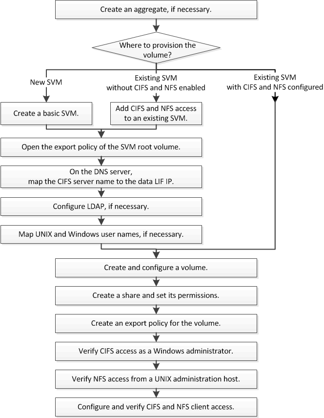

= Workflow di configurazione multiprotocollo
:allow-uri-read: 
:icons: font
:imagesdir: ../media/

[role="lead"]
La configurazione di SMB/CIFS e NFS richiede la creazione opzionale di un aggregato, la creazione di una nuova SVM o la configurazione di una esistente, la creazione di un volume, la condivisione e l'esportazione e la verifica dell'accesso da host di amministrazione UNIX e Windows. È quindi possibile aprire l'accesso ai client SMB/CIFS e NFS.

