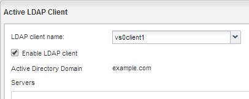

= Configurare LDAP (creare una nuova SVM abilitata per NFS)
:allow-uri-read: 
:icons: font
:imagesdir: ../media/

[role="lead"]
Se si desidera che la macchina virtuale di storage (SVM) ottenga le informazioni utente dal protocollo LDAP (Lightweight Directory Access Protocol) basato su Active Directory, è necessario creare un client LDAP, attivarlo per la SVM e assegnare la priorità LDAP ad altre fonti di informazioni utente.

.Prima di iniziare
* La configurazione LDAP deve utilizzare Active Directory (ad).
+
Se si utilizza un altro tipo di LDAP, è necessario utilizzare l'interfaccia della riga di comando (CLI) e altra documentazione per configurare LDAP.

+
https://www.netapp.com/pdf.html?item=/media/10720-tr-4067.pdf["Report tecnico NetApp 4067: NFS in NetApp ONTAP"^]

+
https://www.netapp.com/pdf.html?item=/media/19384-tr-4616.pdf["Report tecnico NetApp 4616: NFS Kerberos in ONTAP con Microsoft Active Directory"^]

+
https://www.netapp.com/pdf.html?item=/media/19423-tr-4835.pdf["Report tecnico di NetApp 4835: Come configurare LDAP in ONTAP"^]

* È necessario conoscere il dominio e i server di ad, nonché le seguenti informazioni di binding: Il livello di autenticazione, l'utente e la password di binding, il DN di base e la porta LDAP.

.Fasi
. Accedere alla finestra *SVM*.
. Selezionare la SVM richiesta
. Fare clic sulla scheda *Impostazioni SVM*.
. Impostare un client LDAP per SVM da utilizzare:
+
.. Nel riquadro *servizi*, fare clic su *Client LDAP*.
.. Nella finestra *LDAP Client Configuration* (Configurazione client LDAP), fare clic su *Add* (Aggiungi).
.. Nella scheda *Generale* della finestra *Crea client LDAP*, digitare il nome della configurazione del client LDAP, ad esempio `vs0client1`.
.. Aggiungere il dominio ad o i server ad.
+
image::../media/ldap_client_creation_general_tab_nas_mp.gif[Questa immagine viene spiegata dal testo circostante.]

.. Fare clic su *binding* e specificare il livello di autenticazione, l'utente e la password di binding, il DN di base e la porta.
+
image::../media/ldap_client_creation_binding_tab_nas_mp.gif[Questa immagine viene spiegata dal testo circostante.]

.. Fare clic su *Save and Close* (Salva e chiudi).

+
Viene creato un nuovo client che può essere utilizzato da SVM.

. Abilitare il nuovo client LDAP per SVM:
+
.. Nel riquadro di navigazione, fare clic su *Configurazione LDAP*.
.. Fare clic su *Edit* (Modifica).
.. Assicurarsi che il client appena creato sia selezionato in *Nome client LDAP*.
.. Selezionare *Enable LDAP client* (attiva client LDAP) e fare clic su *OK*.
+

+
SVM utilizza il nuovo client LDAP.

. Assegnare la priorità LDAP ad altre fonti di informazioni utente, ad esempio NIS (Network Information Service) e utenti e gruppi locali:
+
.. Accedere alla finestra *SVM*.
.. Selezionare la SVM e fare clic su *Edit* (Modifica).
.. Fare clic sulla scheda *servizi*.
.. In *Name Service Switch*, specificare *LDAP* come origine preferita dello switch name service per i tipi di database.
.. Fare clic su *Save and Close* (Salva e chiudi).
+
image::../media/name_services_ldap_priority_nas_mp.gif[Questo grafico è descritto dal testo circostante.]

+
LDAP è la fonte principale delle informazioni utente per i servizi di nome e la mappatura dei nomi su questa SVM.

