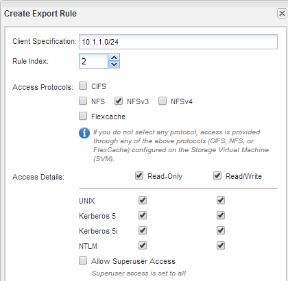

= Configurare e verificare l'accesso al client CIFS e NFS
:allow-uri-read: 
:icons: font
:imagesdir: ../media/

[role="lead"]
Una volta pronti, è possibile configurare l'accesso client impostando le autorizzazioni per i file UNIX o NTFS, modificando l'ACL di condivisione e aggiungendo una regola di esportazione. Quindi, verificare che gli utenti o i gruppi interessati possano accedere al volume.

.Fasi
. Decidere quali client e utenti o gruppi avranno accesso alla condivisione.
. Impostare le autorizzazioni del file utilizzando un metodo che corrisponde allo stile di protezione del volume:
+
|===
| Se lo stile di sicurezza del volume è questo... | Eseguire questa operazione... 

 a| 
NTFS
 a| 
.. Accedere a un client Windows come amministratore con diritti amministrativi sufficienti per gestire le autorizzazioni NTFS.
.. In Esplora risorse, fare clic con il pulsante destro del mouse sull'unità, quindi selezionare *Proprietà*.
.. Selezionare la scheda Security (sicurezza) e regolare le impostazioni di protezione per i gruppi e gli utenti in base alle esigenze.

 a| 
UNIX
 a| 
Su un host di amministrazione UNIX, utilizzare l'utente root per impostare la proprietà e le autorizzazioni UNIX sul volume.

|===
. In System Manager, modificare l'ACL della condivisione per consentire agli utenti o ai gruppi Windows di accedere alla condivisione.
+
.. Accedere alla finestra *Shares*.
.. Selezionare la condivisione e fare clic su *Modifica*.
.. Selezionare la scheda *Permissions* e assegnare agli utenti o ai gruppi l'accesso alla condivisione.

. In System Manager, aggiungere regole ai criteri di esportazione per consentire ai client NFS di accedere alla condivisione.
+
.. Selezionare la macchina virtuale di storage (SVM) e fare clic su *SVM Settings* (Impostazioni SVM).
.. Nel riquadro *Policies*, fare clic su *Export Policies* (Esporta policy).
.. Selezionare il criterio di esportazione applicato al volume.
.. Nella scheda *regole di esportazione*, fare clic su *Aggiungi* e specificare un set di client.
.. Selezionare *2* come *Rule Index* in modo che questa regola venga eseguita dopo la regola che consente l'accesso all'host di amministrazione.
.. Selezionare *CIFS* e *NFSv3*.
.. Specificare i dettagli di accesso desiderati e fare clic su *OK.*
+
È possibile fornire l'accesso completo in lettura/scrittura ai client digitando la subnet `10.1.1.0/24` Come *Client Specification* (specifica client) e selezionando tutte le caselle di controllo Access (accesso) ad eccezione di *Allow Superuser Access* (Consenti accesso superutente).

+

. Su un client Windows, accedere come uno degli utenti che ora ha accesso alla condivisione e ai file e verificare di poter accedere alla condivisione e creare un file.
. Su un client UNIX, accedere come uno degli utenti che ora ha accesso al volume e verificare che sia possibile montare il volume e creare un file.

