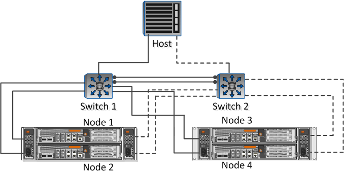

= Completare il foglio di lavoro per la configurazione del client NFS
:allow-uri-read: 
:icons: font
:imagesdir: ../media/

[role="lead"]
Sono necessari indirizzi di rete e informazioni di configurazione dello storage per eseguire le attività di configurazione del client NFS.

== Indirizzi di rete di destinazione

È necessaria una subnet con due indirizzi IP per i file LIF dei dati NFS per ciascun nodo del cluster. Per l'alta disponibilità, sono necessarie due reti separate. Gli indirizzi IP specifici vengono assegnati da ONTAP quando si creano le LIF come parte della creazione della SVM.

Se possibile, separare il traffico di rete su reti fisiche separate o su VLAN.

Subnet per LIF:

|===
| Nodo o LIF con porta a switch | Indirizzo IP | Maschera di rete | Gateway | ID VLAN | Porta home 

 a| 
Nodo 1 / LIF allo switch 1
 a| 
 a| 
 a| 
 a| 
 a| 

 a| 
Nodo 2 / LIF allo switch 1
 a| 
 a| 
 a| 
 a| 
 a| 

 a| 
Nodo 3/LIF allo switch 1
 a| 
 a| 
 a| 
 a| 
 a| 

 a| 
Nodo 4/LIF allo switch 1
 a| 
 a| 
 a| 
 a| 
 a| 

 a| 
Nodo 1/LIF allo switch 2
 a| 
 a| 
 a| 
 a| 
 a| 

 a| 
Nodo 2/LIF allo switch 2
 a| 
 a| 
 a| 
 a| 
 a| 

 a| 
Nodo 3/LIF allo switch 2
 a| 
 a| 
 a| 
 a| 
 a| 

 a| 
Nodo 4/LIF allo switch 2
 a| 
 a| 
 a| 
 a| 
 a| 

|===

== Configurazione dello storage

Se l'aggregato e sono già stati creati, registrare i nomi qui; in caso contrario, è possibile crearli come richiesto:

|===
| Nodo per l'esportazione NFS 

 a| 
Nome dell'aggregato

 a| 
nome

|===

== Informazioni sull'esportazione NFS

|===
| Dimensione di esportazione 

 a| 
Nome esportazione (opzionale)

 a| 
Descrizione dell'esportazione (opzionale)

|===

== Informazioni SVM

Se non si utilizza un esistente , sono necessarie le seguenti informazioni per crearne uno nuovo:

[cols="1a,1a"]
|===
2+| Nome SVM 

 a| 
Aggregato per il volume root SVM

 a| 
Nome utente SVM (opzionale)

 a| 
Password SVM (opzionale)

 a| 
LIF di gestione SVM (opzionale)

 a| 
 a| 
Subnet:

 a| 
 a| 
Indirizzo IP:

 a| 
 a| 
Maschera di rete:

 a| 
 a| 
Gateway:

 a| 
 a| 
Nodo principale:

|===