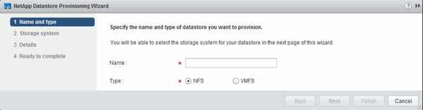

= Eseguire il provisioning di un datastore e crearne il volume contenente
:allow-uri-read: 
:icons: font
:imagesdir: ../media/

[role="lead"]
Un datastore contiene macchine virtuali e relativi VMDK sull'host ESXi. Il provisioning del datastore sull'host ESXi viene eseguito su un volume nel cluster di storage.

.Prima di iniziare
Virtual Storage Console per VMware vSphere per (VSC) deve essere installato e registrato con il vCenter Server che gestisce l'host ESXi.

VSC deve disporre di un cluster o di credenziali sufficienti per creare il volume sulla SVM specificata.

.A proposito di questa attività
VSC automatizza il provisioning del datastore, inclusa la creazione di un volume sulla SVM specificata.

.Fasi
. Dalla pagina iniziale di vSphere Web Client, fare clic su *host e cluster*.
. Nel riquadro di navigazione, espandere il data center in cui si desidera eseguire il provisioning del datastore.
. Fare clic con il pulsante destro del mouse sull'host ESXi, quindi selezionare *NetApp VSC* > *Provision Datastore*.
+
In alternativa, è possibile fare clic con il pulsante destro del mouse sul cluster durante il provisioning per rendere il datastore disponibile a tutti gli host del cluster.

. Fornire le informazioni richieste nella procedura guidata:
+

