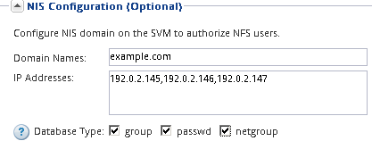

= Creare una nuova SVM con un volume NFS ed esportarla
:allow-uri-read: 
:icons: font
:imagesdir: ../media/

[role="lead"]
È possibile utilizzare una procedura guidata che guida l'utente nel processo di creazione della macchina virtuale di storage (SVM), configurazione del DNS (Domain Name System), creazione di un'interfaccia logica dati (LIF), attivazione di NFS, configurazione opzionale di NIS, quindi creazione ed esportazione di un volume.

.Prima di iniziare
* La rete deve essere configurata e le relative porte fisiche devono essere collegate alla rete.
* È necessario sapere quali dei seguenti componenti di rete verranno utilizzati da SVM:
+
** Il nodo e la porta specifica su quel nodo in cui verrà creata l'interfaccia logica dati (LIF)
** La subnet da cui verrà fornito l'indirizzo IP del LIF dei dati o, facoltativamente, l'indirizzo IP specifico che si desidera assegnare al LIF dei dati
** Informazioni NIS, se il sito utilizza NIS per i servizi di nome o la mappatura dei nomi

* La subnet deve essere instradabile a tutti i server esterni richiesti per servizi come NIS (Network Information Service), LDAP (Lightweight Directory Access Protocol), ad (Active Directory) e DNS.
* Tutti i firewall esterni devono essere configurati in modo appropriato per consentire l'accesso ai servizi di rete.
* L'ora dei controller di dominio ad, dei client e di SVM deve essere sincronizzata entro cinque minuti l'una dall'altra.

.Fasi
. Accedere alla finestra *SVM*.
. Fare clic su *Crea.*
. Nella finestra di dialogo *Storage Virtual Machine (SVM) Setup*, creare il campo SVM:
+
.. Specificare un nome univoco per la SVM.
+
Il nome deve essere un FQDN (Fully Qualified Domain Name) o seguire un'altra convenzione che garantisca nomi univoci in un cluster.

.. Selezionare tutti i protocolli per i quali si dispone di licenze e che verranno utilizzati sulla SVM, anche se non si desidera configurare immediatamente tutti i protocolli.
+
Se alla fine è richiesto l'accesso CIFS, è necessario selezionare *CIFS* ora in modo che i client CIFS e NFS possano condividere gli stessi dati LIF.

.. Mantenere l'impostazione predefinita della lingua, C.UTF-8.
+
[NOTE]
====
Se si supporta la visualizzazione internazionale dei caratteri nei client NFS e SMB/CIFS, si consiglia di utilizzare il codice lingua *UTF8MB4*, disponibile a partire da ONTAP 9.5.

====
+
Questa lingua viene ereditata dal volume creato in seguito e la lingua di un volume non può essere modificata.

.. *Opzionale*: Se è stato attivato il protocollo CIFS, modificare lo stile di protezione in *UNIX*.
+
Selezionando il protocollo CIFS, lo stile di protezione viene impostato su NTFS per impostazione predefinita.

.. *Opzionale*: Selezionare l'aggregato root per contenere il volume root SVM.
+
L'aggregato selezionato per il volume root non determina la posizione del volume di dati. L'aggregato per il volume di dati viene selezionato automaticamente quando si esegue il provisioning dello storage in un passaggio successivo.

+
image::../media/svm_setup_details_unix_selected_nfs.gif[Questo grafico è spiegato dal testo che lo circonda.]

.. Nell'area *Configurazione DNS*, assicurarsi che il dominio di ricerca DNS predefinito e i server dei nomi siano quelli che si desidera utilizzare per questa SVM.
+
image::../media/svm_setup_details_dns_nfs.gif[Questo grafico è spiegato dal testo che lo circonda.]

.. Fare clic su *Invia e continua*.

+
La SVM viene creata, ma i protocolli non sono ancora configurati.

. Nella sezione *Data LIF Configuration* della pagina *Configure CIFS/NFS Protocol* (Configura protocollo CIFS/NFS), specificare i dettagli della LIF che i client utilizzeranno per accedere ai dati:
+
.. Assegnare automaticamente un indirizzo IP alla LIF da una subnet specificata o immetterlo manualmente.
.. Fare clic su *Browse* (Sfoglia) e selezionare un nodo e una porta da associare alla LIF.
+
image::../media/svm_setup_cifs_nfs_page_lif_multi_nas_nfs.gif[Questo grafico è descritto dal testo circostante.]

. Se l'area *NIS Configuration* (Configurazione NIS) è compressa, espanderla.
. Se il sito utilizza NIS per la mappatura dei nomi o dei nomi, specificare il dominio e gli indirizzi IP dei server NIS.
+

. Creare ed esportare un volume per l'accesso NFS:
+
.. Per *Nome esportazione*, digitare un nome che sia il nome dell'esportazione e l'inizio del nome del volume.
.. Specificare una dimensione per il volume che conterrà i file.
+
image::../media/svm_setup_cifs_nfs_page_nfs_export_nfs.gif[Schermata dell'area in cui si configura l'esportazione NFS]

+
Non è necessario specificare l'aggregato per il volume perché viene posizionato automaticamente sull'aggregato con lo spazio più disponibile.

.. Nel campo *Permission*, fare clic su *Change* e specificare una regola di esportazione che consente a NFSv3 di accedere a un host di amministrazione UNIX, incluso l'accesso Superuser.
+
image::../media/export_rule_for_admin_manual_nfs_nfs.gif[Questa immagine viene spiegata dal testo circostante.]

+
È possibile creare un volume da 10 GB denominato Eng, esportarlo come Eng e aggiungere una regola che consente al client "`admin_host`" di accedere all'esportazione, incluso l'accesso Superuser.

. Fare clic su *Invia e continua*.
+
Vengono creati i seguenti oggetti:

+
** Una LIF di dati denominata dopo la SVM con il suffisso "`_nfs_lif1`"
** Un server NFS
** Un volume che si trova sull'aggregato con lo spazio più disponibile e ha un nome che corrisponde al nome dell'esportazione e termina con il suffisso "`_NFS_volume`"
** Un'esportazione per il volume
** Un criterio di esportazione con lo stesso nome dell'esportazione

. Per tutte le altre pagine di configurazione del protocollo visualizzate, fare clic su *Skip* (Ignora) e configurare il protocollo in un secondo momento.
. Quando viene visualizzata la pagina *SVM Administration* (Amministrazione SVM), configurare o rinviare la configurazione di un amministratore separato per questa SVM:
+
** Fare clic su *Ignora* e configurare un amministratore in un secondo momento, se necessario.
** Inserire le informazioni richieste, quindi fare clic su *Submit & Continue* (Invia e continua).

. Esaminare la pagina *Riepilogo*, annotare le informazioni eventualmente necessarie in un secondo momento, quindi fare clic su *OK*.
+
I client NFS devono conoscere l'indirizzo IP del file LIF dei dati.

.Risultati
Viene creata una nuova SVM con un server NFS contenente un nuovo volume esportato per un amministratore.
