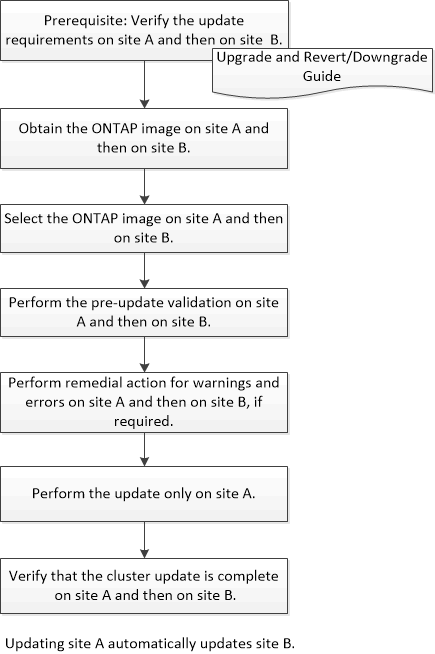

= Aggiornare i cluster in una configurazione MetroCluster con Gestione di sistema - ONTAP 9.7 e versioni precedenti
:allow-uri-read: 
:icons: font
:imagesdir: ../media/

[role="lead"]
Per aggiornare un cluster nelle configurazioni MetroCluster, è possibile utilizzare Gestione di sistema ONTAP classic (disponibile in ONTAP 9.7 e versioni precedenti). È necessario eseguire ciascuna operazione su entrambi i cluster, ad eccezione dell'aggiornamento del cluster.

*Informazioni correlate*

https://docs.netapp.com/us-en/ontap/upgrade/task_upgrade_andu_sm.html["Upgrade ONTAP (Aggiorna server)"]
