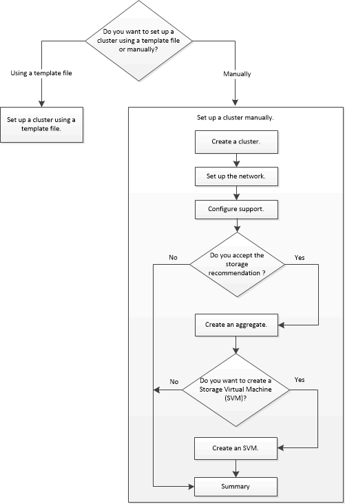

= Configurare il cluster con Gestore di sistema di ONTAP - ONTAP 9.7 e versioni precedenti
:allow-uri-read: 
:icons: font
:imagesdir: ../media/

[role="lead"]
È possibile utilizzare Gestore di sistema ONTAP classic (disponibile in ONTAP 9.7 e versioni precedenti) per configurare un cluster creando un cluster, impostando la rete di gestione dei nodi e la rete di gestione dei cluster e impostando le notifiche degli eventi.

.Prima di iniziare
* È necessario aver configurato gli indirizzi IP di gestione dei nodi per almeno un nodo.
* I nodi devono essere nella modalità predefinita di ha.
* I nodi devono eseguire ONTAP 9.1 o versione successiva.
* I nodi devono essere della stessa versione.
* Tutti i nodi devono essere integri e il cablaggio dei nodi deve essere impostato.
* Per la configurazione del cluster, è necessario disporre di cavi e connettività.
* È necessario disporre di una gestione del cluster, di una gestione dei nodi, di indirizzi IP del Service Processor e di dettagli su gateway e netmask sufficienti.
* Se l'interfaccia del cluster è presente su una porta, tale porta deve essere presente nell'IPSpace del cluster.

.A proposito di questa attività
Per creare un cluster, è necessario effettuare l'accesso tramite la console e configurare l'indirizzo IP di gestione dei nodi su qualsiasi nodo della rete del cluster. Dopo aver configurato l'indirizzo IP di gestione dei nodi su un nodo, è possibile aggiungere altri nodi e creare un cluster utilizzando Gestione di sistema di ONTAP.

L'operazione di configurazione del cluster non è supportata nelle configurazioni MetroCluster per il software ONTAP.

È possibile configurare il cluster utilizzando un file di modello o inserendo manualmente i valori nella procedura guidata di installazione del cluster.

