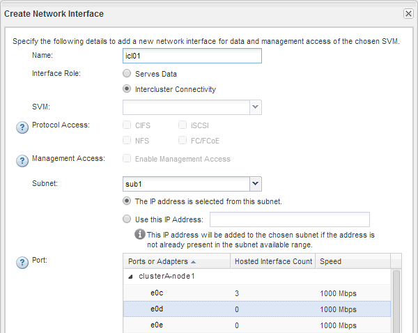

= Creazione di interfacce di intercluster su tutti i nodi (ONTAP 9.2 o versioni precedenti)
:allow-uri-read: 
:icons: font
:imagesdir: ../media/

[role="lead"]
Utilizzando l'interfaccia _classic_ di Gestore di sistema di ONTAP con ONTAP 9.2 o una versione precedente di ONTAP 9, è possibile creare LIF intercluster da utilizzare per il peering.

I cluster comunicano tra loro attraverso interfacce logiche (LIF) dedicate alla comunicazione tra cluster. È necessario creare una LIF intercluster all'interno di ogni IPSpace che verrà utilizzato per il peering.  Le LIF devono essere create su ciascun nodo di ciascun cluster per il quale si desidera creare una relazione peer.

.Prima di iniziare
È necessario aver identificato la subnet, le porte e, facoltativamente, gli indirizzi IP che si intende utilizzare per le LIF dell'intercluster.

.A proposito di questa attività
È necessario eseguire questa procedura su entrambi i cluster per i quali si desidera creare una relazione peer. Ad esempio, se si dispone di un cluster a quattro nodi che si desidera eseguire il peer con il cluster X su IPSpace A e il peer con il cluster Y su IPSpace Y, è necessario un totale di otto LIF intercluster; Quattro su IPSpace A (uno per nodo) e quattro su IPSpace Y (uno per nodo).

.Fasi
. [[step1-intercluster-lif]]creare una LIF di intercluster su un nodo del cluster di origine:
+
.. Accedere alla finestra *Network Interfaces* (interfacce di rete).
.. Fare clic su *Create* (Crea).
+
Viene visualizzata la finestra di dialogo Create Network Interface (Crea interfaccia di rete).

.. Immettere un nome per la LIF dell'intercluster.
+
È possibile utilizzare "`icl01`" per la LIF dell'intercluster sul primo nodo e "`icl02`" per la LIF dell'intercluster sul secondo nodo.

.. Selezionare *Intercluster Connectivity* come ruolo dell'interfaccia.
.. Selezionare IPSpace.
.. Nella finestra di dialogo *Aggiungi dettagli*, selezionare *utilizzando una subnet* dall'elenco a discesa *Assegna indirizzo IP*, quindi selezionare la subnet che si desidera utilizzare per la comunicazione tra cluster.
+
Per impostazione predefinita, l'indirizzo IP viene selezionato automaticamente dalla subnet dopo aver fatto clic su *Create* (Crea). Se non si desidera utilizzare l'indirizzo IP selezionato automaticamente, è necessario specificare manualmente l'indirizzo IP utilizzato dal nodo per la comunicazione tra cluster.

.. Se si desidera specificare manualmente l'indirizzo IP utilizzato dal nodo per la comunicazione tra cluster, selezionare *Usa questo indirizzo IP* e digitare l'indirizzo IP.
+
Assicurarsi che l'indirizzo IP che si desidera utilizzare sia già disponibile nella subnet o che possa essere aggiunto alla subnet in un secondo momento.

.. Nell'area *Porte*, fare clic sul nodo che si sta configurando e selezionare la porta che si desidera utilizzare per questo nodo.
.. Se si decide di non condividere le porte per la comunicazione tra cluster e la comunicazione dati, verificare che la porta selezionata visualizzi "`0`" nella colonna *Hosted Interface Count*.
+

.. Fare clic su *Create* (Crea).

. Ripetere <<step1-intercluster-lif,Fase 1>> per ogni nodo del cluster.
+
Ciascun nodo del cluster dispone di una LIF intercluster.

. Prendere nota degli indirizzi IP delle LIF dell'intercluster in modo da poterli utilizzare in un secondo momento quando si creano relazioni peer con altri cluster:
+
.. Nella finestra *Network Interfaces*, nella colonna *role*, fare clic su image:../media/icon_columnfilter_sm_peering.gif["Icona del filtro di colonna"]Deselezionare la casella di controllo *tutto*, quindi selezionare *Intercluster*.
+
La finestra Network Interfaces (interfacce di rete) visualizza solo le LIF dell'intercluster.

.. Annotare gli indirizzi IP elencati nella colonna *IP Addresses/WWPN* (indirizzi IP/WWPN*) oppure lasciare aperta la finestra *Network Interfaces* (interfacce di rete) per recuperare gli indirizzi IP in un secondo momento.
+
È possibile fare clic sull'icona di visualizzazione delle colonne (image:../media/icon_columnshowhide_sm_onc_peering.gif["Icona per mostrare o nascondere la colonna"]) per nascondere le colonne che non si desidera visualizzare.

.Risultati
Tutti i nodi di ciascun cluster dispongono di LIF intercluster in grado di comunicare tra loro.
