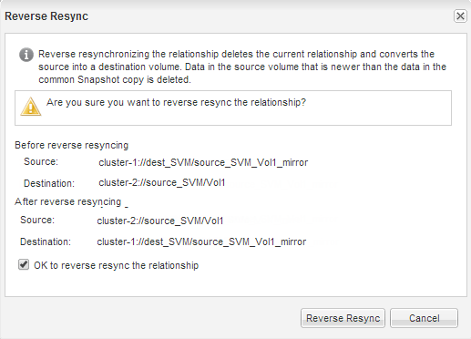

= Riattivare il volume di origine
:allow-uri-read: 
:icons: font
:imagesdir: ../media/

[role="lead"]
Dopo aver risincronizzato i dati dal volume di destinazione al volume di origine, è necessario attivare il volume di origine interrompendo la relazione SnapMirror. Quindi, risincronizzare il volume di destinazione per proteggere il volume di origine riattivato.

.A proposito di questa attività
Sia le operazioni di interruzione che di risincronizzazione inversa vengono eseguite dal cluster *source*.

L'immagine seguente mostra che i volumi di origine e di destinazione vengono letti/scritti quando si rompe la relazione SnapMirror. Dopo l'operazione di risincronizzazione inversa, i dati vengono replicati dal volume di origine attivo al volume di destinazione di sola lettura.

image::../media/reactivatng_source.gif[L'immagine mostra le operazioni di interruzione e risincronizzazione di SnapMirror]

.Fasi
. A seconda della versione di System Manager in esecuzione, eseguire una delle seguenti operazioni:
+
** ONTAP 9.4 o versione precedente: Fare clic su *protezione* > *relazioni*.
** A partire da ONTAP 9.5: Fare clic su *protezione* > *Relazioni volume*.

. Selezionare la relazione di SnapMirror tra i volumi di origine e di destinazione.
. Fare clic su *operazioni* > *Quiesce*.
. Selezionare la casella di controllo di conferma, quindi fare clic su *Quiesce*.
. Fare clic su *operazioni* > *interruzione*.
. Selezionare la casella di controllo di conferma, quindi fare clic su *Interrompi*.
+
image::../media/snapmirror_return_break.gif[Schermata che mostra la finestra di dialogo Interrompi.]

. Fare clic su *operazioni* > *risincronizzazione inversa*.
. Selezionare la casella di controllo di conferma, quindi fare clic su *Reverse Resync* (risincronizzazione inversa).
+

+
A partire da ONTAP 9.3, il criterio SnapMirror della relazione è impostato su `MirrorAllSnapshots` La pianificazione di SnapMirror è impostata su `None`.

+
Se si utilizza ONTAP 9.2 o versioni precedenti, il criterio SnapMirror della relazione viene impostato su `DPDefault` La pianificazione di SnapMirror è impostata su `None`.

. Accedere al volume di origine nella pagina Volumes (volumi) e verificare che la relazione SnapMirror creata sia elencata e che lo stato della relazione sia `Snapmirrored`.
. Nel cluster di destinazione, specificare un criterio e una pianificazione SnapMirror che corrispondano alla configurazione di protezione della relazione SnapMirror originale per la nuova relazione SnapMirror:
+
.. A seconda della versione di System Manager in esecuzione, eseguire una delle seguenti operazioni:
+
*** ONTAP 9.4 o versione precedente: Fare clic su *protezione* > *relazioni*.
*** A partire da ONTAP 9.5: Fare clic su *protezione* > *Relazioni volume*.

.. Selezionare la relazione di SnapMirror tra i volumi di origine riattivati e quelli di destinazione, quindi fare clic su *Edit* (Modifica).
.. Selezionare il criterio e la pianificazione di SnapMirror, quindi fare clic su *OK*.

.Risultati
Il volume di origine dispone di accesso in lettura/scrittura ed è protetto dal volume di destinazione.
