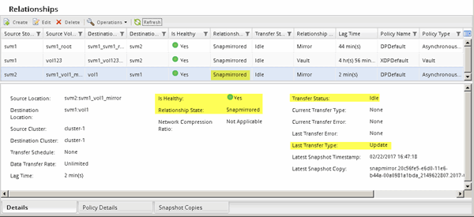

= Aggiornare il volume di origine
:allow-uri-read: 
:icons: font
:imagesdir: ../media/

[role="lead"]
Dopo aver risincronizzato il volume di origine, è possibile assicurarsi che tutte le modifiche più recenti siano aggiornate sul volume di origine prima di attivare il volume di origine.

.A proposito di questa attività
È necessario eseguire questa attività dal cluster *source*.

.Fasi
. A seconda della versione di System Manager in esecuzione, eseguire una delle seguenti operazioni:
+
** ONTAP 9.4 o versione precedente: Fare clic su *protezione* > *relazioni*.
** A partire da ONTAP 9.5: Fare clic su *protezione* > *Relazioni volume*.

. Selezionare la relazione di SnapMirror tra i volumi di origine e di destinazione, quindi fare clic su *Operations* > *Update*.
. Eseguire un trasferimento incrementale dalla copia Snapshot comune recente tra i volumi di origine e di destinazione.
+
** A partire da ONTAP 9.3: Selezionare l'opzione *come da policy*.
** ONTAP 9.2 o versioni precedenti: Selezionare l'opzione *on demand*.

. *Opzionale:* selezionare *limita larghezza di banda di trasferimento a* per limitare la larghezza di banda di rete utilizzata per i trasferimenti, quindi specificare la velocità massima di trasferimento.
. Fare clic su *Aggiorna*.
. Verificare che lo stato del trasferimento sia `Idle` e l'ultimo tipo di trasferimento è `Update` Nella scheda *Dettagli*.
+

